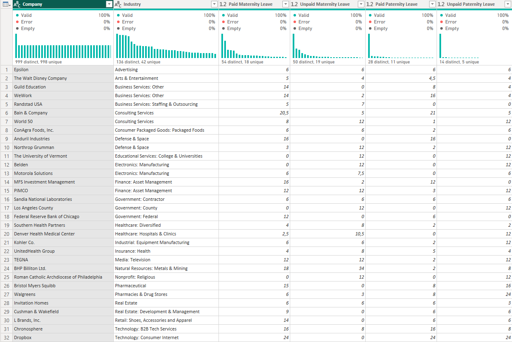
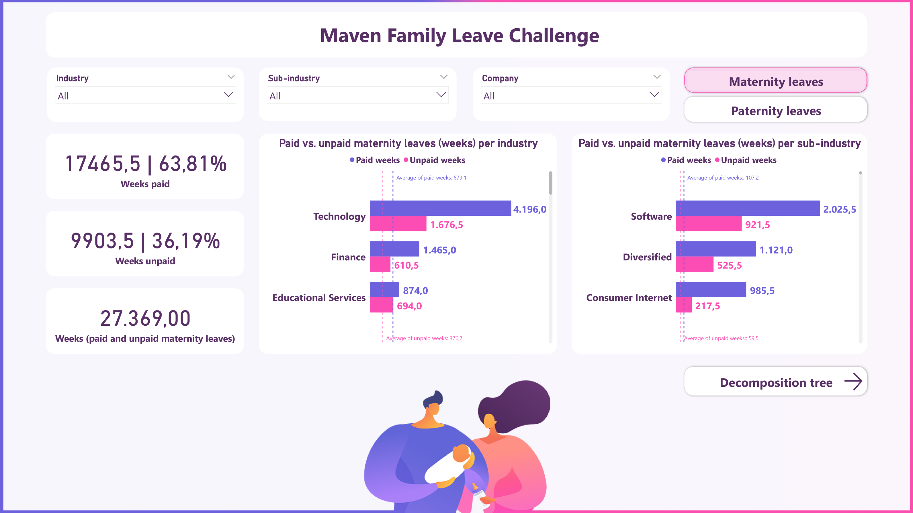

# Maven Family Leave Challenge

This is the official dataset for the Maven Family Leave Challenge.
For a chance to win a free annual membership, your task is to create an impactful visual for an article on parental leave policies across the business world.

"Parental leave is a major consideration for both job seekers and employers who want to hire them. On one hand, employees want to know that their companies will support their family planning goals and accommodate a healthy work-life balance. On the other hand, parental leave whether (paid or unpaid) often presents significant business challenges." - Written by LAUREN HANSEN, TechnologyAdvice 2023

# About this project

Project Description:
This project focuses on the importance of parental leave policies for job seekers and employees. To help people gain insight into the different types of parental leave policies across various industries in EUA, data from 1,601 companies were collected through crowdsourcing. This data includes information on paid and unpaid weeks available for both maternity and paternity leave. By analyzing this data, individuals and organizations can make better-informed decisions about employment and benefits. Ultimately, this information can promote a more supportive and equitable work environment for all employees, regardless of their parental status.

Dashboard Design:
The dashboard design is minimalistic, inviting with the color scheme that conveys a sense of family, and unity, and creates a welcoming environment for users. The clean and simple design allows users to quickly and easily access the information they need without being overwhelmed by cluttered visuals or distracting elements. The dashboard strikes a balance between aesthetic appeal and functional design, creating a user-friendly platform that is both visually pleasing and easy to use.

# Data Cleaning / Data Transformation

The dataset's column for paid and unpaid maternity and paternity leave contains data type errors, as they are stored as text instead of numerical values, which makes it challenging to interpret the data correctly. To facilitate analysis and ensure accurate representation of the data, we have replaced all "N/A" values with zero.

# DAX

# Report Presentation

