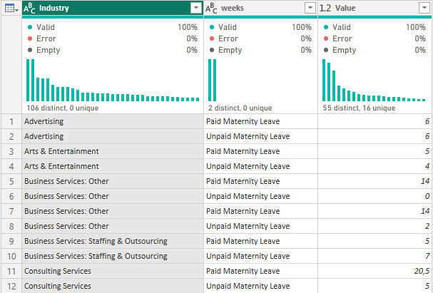

# About this project

__Maven Family Leave Challenge:__
This is the official dataset for the Maven Family Leave Challenge.
For a chance to win a free annual membership, your task is to create an impactful visual for an article on parental leave policies across the business world.

__Project Description:__
This project focuses on the importance of parental leave policies for job seekers and employees. To help people gain insight into the different types of parental leave policies across various industries in EUA, data from 1,601 companies were collected through crowdsourcing. This data includes information on paid and unpaid weeks available for both maternity and paternity leave. By analyzing this data, individuals and organizations can make better-informed decisions about employment and benefits. Ultimately, this information can promote a more supportive and equitable work environment for all employees, regardless of their parental status.

__Dashboard Design:__
The dashboard design is minimalistic, inviting with the color scheme that conveys a sense of family, and unity, and creates a welcoming environment for users. The clean and simple design allows users to quickly and easily access the information they need without being overwhelmed by cluttered visuals or distracting elements. The dashboard strikes a balance between aesthetic appeal and functional design, creating a user-friendly platform that is both visually pleasing and easy to use.

# Data Cleaning / Data Transformation


The dataset's column for paid and unpaid maternity and paternity leave contains data type errors, as they are stored as text instead of numerical values, which makes it challenging to interpret the data correctly. To facilitate analysis and ensure accurate representation of the data, we have replaced all "N/A" values with zero.

# DAX
In order to display both the numerical value and the percentage in a chart visualization, I start by generating separate measures as follows:
```dax
M PaidMaternity = SUM(fParental_leave[Paid Maternity Leave])
```
```dax
M Total of weeks = 
Var PaidMaternity = [M PaidMaternity]
Var UnpaidMaternity = [M UnpaidMaternity]

return PaidMaternity+UnpaidMaternity
```
```dax
%MPaid = 
VAR percentage = [M PaidMaternity]/[M Total of weeks]
Return percentage
```
I proceed to create an additional measure that will showcase both outcomes:
```dax
M Weeks paid = 
VAR PaidMaternityVAR =[M PaidMaternity]
VAR percentage = [%MPaid]

Return VALUE(PaidMaternityVAR)&" | "&FORMAT(percentage,"Percent")
```
To show the aggregated data of minimum, maximum and average, first I tried by measure:
```dax
M MIN/MAX/AVR of unpaid weeks = 
 VAR minium = MIN(fParental_leave[Unpaid Maternity Leave])
 VAR maximum = MAX(fParental_leave[Unpaid Maternity Leave])
 VAR averaaa = FORMAT(AVERAGEA(fParental_leave[Unpaid Maternity Leave]),"##.#")
 
 return minium&" / "&maximum&" / "&averaaa
```
But then I chose to umpivot the fact table and use a mask combination with measures for a better visualization of the data in the visual, so I created the separate measures and added them in layers in the matrix visual:

Unpivoted table:



```dax
M averaaa = FORMAT(AVERAGEA('dPivotedParentalLeave'[Value]),"##.#")
```
```dax
M maximum = MAX('dPivotedParentalLeave'[Value])
```
```dax
M minium = MIN('dPivotedParentalLeave'[Value])
```
# Report Presentation


<p align="center">Desenvolvido por <a href="https://github.com/RaphaelPuntel">Raphael Puntel ♠️</a></p>
